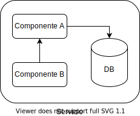

# Propuesta de solución para Hackathon Ceiba 2021

## Descripción de la solución 

Describa brevemente la estrategia de solución para el problema planteado

## Drivers que orientan la toma de decisiones para la solución propuesta

Enumere los drivers de arquitectura (requisitos no funcionales) que su equipo tuvo en cuenta en la solución propuesta. P.ej: Seguridad, Usabilidad, etc.

## Diagrama de solución 

Apoyados del plugin de [Draw.io Integration - Henning Dieterichs](https://marketplace.visualstudio.com/items?itemName=hediet.vscode-drawio) , puede plasmar un diseño gráfico que soporte la estrategia descrita en el punto anterior. 

| Elemento | Descripción |
| :----    | :---        | 
| DB | Guardar datos |    

## Otras ayudas didácticas

Para efecto de agilizar un poco mas el desarrollo, aqui dejamos algunos dockerfiles-

* [Go](./Dockerfile-go)
* [Java](./Dockerfile-java)
* [.NET](./Dockerfile-net6)
* [Node.js](./Dockerfile-node)
* [Python](./Dockerfile-py-flask)
* [Rust](./Dockerfile-rust)
